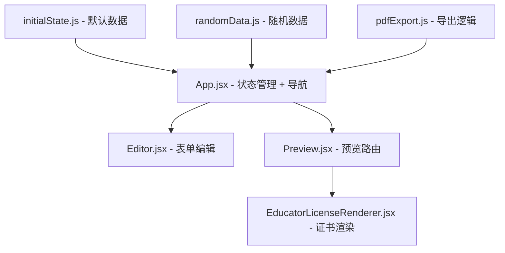

# 设计文档：教育工作者执照证书生成器

## 概述

为 Payslip Generator 应用新增 `educatorLicense` 文档类型，遵循项目现有的架构模式：在 `initialState.js` 中定义默认数据 → `Editor.jsx` 中添加条件编辑区域 → `Preview.jsx` 中注册路由 → 独立 `EducatorLicenseRenderer.jsx` 渲染证书。

该证书以美国俄亥俄州教育部教师执照为视觉原型，包含装饰性边框、哥特式标题字体、执照信息区、教学领域列表、续期要求、红色证书编号及双签名栏。

## 架构

项目采用单页 React 应用架构，状态集中管理于 `App.jsx`，通过 props 向下传递。新增文档类型需要修改以下层级：



数据流向：`initialState` → `App state` → `Editor`（编辑）→ `App state`（更新）→ `Preview` → `Renderer`（渲染）

## 组件与接口

### 1. 状态数据结构 (`initialState.js`)

在 `INITIAL_STATE` 对象中新增 `educatorLicense` 字段：

```javascript
educatorLicense: {
    stateName: 'Ohio',
    departmentName: 'Department of Education',
    licenseType: '4 Year Resident Educator License',
    licenseeName: 'JANE DOE',
    licenseNumber: 'OH1418511',
    issueDate: '2012-06-05',
    validFrom: '2012-07-01',
    validTo: '2016-06-30',
    teachingAreas: [
        { id: 1, area: 'Intervention Specialist (K-12)', endorsements: ['Mild/Moderate', 'Moderate/Intensive'] }
    ],
    renewalRequirements: '3 Sem Hrs In The Teaching Of Phonics Required to Renew',
    certificateNumber: 'EL-2012-0605-1418511',
    signatories: [
        { name: 'John Smith', title: 'Superintendent of Public Instruction' },
        { name: 'Mary Johnson', title: 'Deputy Superintendent' }
    ]
}
```

### 2. EducatorLicenseRenderer 组件

位于 `src/components/renderers/EducatorLicenseRenderer.jsx`。

接口：
```jsx
/**
 * @param {Object} props
 * @param {Object} props.state - Complete application state containing educatorLicense section
 */
const EducatorLicenseRenderer = ({ state }) => { ... }
```

渲染结构（从上到下）：
1. 外层装饰边框容器（双线边框 + 内边距）
2. 州名标题（哥特式字体，居中）
3. 部门名称（居中，较小字号）
4. 执照类型副标题（居中，斜体）
5. 被授权人姓名（粗体、大写、居中）
6. 执照信息区（编号、签发日期、有效期）
7. 授权正文段落
8. 教学领域列表（含缩进的背书项）
9. 续期要求文本
10. 证书编号（红色，底部居中）
11. 双签名栏（左右布局，含签名线和职务）

字体策略：
- 州名使用 CSS `font-family: 'Old English Text MT', 'UnifrakturMaguntia', serif` 模拟哥特式效果
- 其他文本使用 `Georgia, 'Times New Roman', serif` 保持正式感

### 3. Editor 扩展

在 `Editor.jsx` 中添加 `docType === 'educatorLicense'` 条件渲染块，包含：
- 文本输入：stateName, departmentName, licenseType, licenseeName, licenseNumber, renewalRequirements, certificateNumber
- 日期输入：issueDate, validFrom, validTo
- 签名人编辑：两组 name + title 输入
- 教学领域动态列表：每项包含 area 文本输入 + endorsements 逗号分隔文本输入，支持添加/删除

教学领域的添加/删除通过 `handleArrayChange`、`addArrayItem`、`removeArrayItem` 现有机制实现，操作 `educatorLicense.teachingAreas` 数组。

签名人编辑需要嵌套对象更新，通过 `handleChange('educatorLicense', 'signatories', updatedArray)` 实现。

### 4. Preview 路由

在 `Preview.jsx` 的 `rendererMap` 中添加：
```javascript
educatorLicense: <EducatorLicenseRenderer state={state} />
```

### 5. App 导航

在 `App.jsx` 导航栏中添加 "Educator License" 按钮，设置 `docType` 为 `'educatorLicense'`。

### 6. PDF/PNG 导出

- PDF 导出：`educatorLicense` 使用与其他文档类型相同的通用 `exportPayslipToPdf` 逻辑（基于 html2canvas 截图 → jsPDF），使用 portrait 方向
- PNG 导出：复用现有 `exportToPng` 逻辑
- ZIP 导出：在 `allDocTypes` 数组中添加 `'educatorLicense'`，在 `docLabels` 中添加对应标签

### 7. 随机数据生成

在 `randomData.js` 的 `generateRandomData` 函数返回对象中添加 `educatorLicense` 字段，使用预定义的数据池随机组合：
- 州名池：Ohio, California, Texas, New York, Florida, Illinois, Pennsylvania 等
- 执照类型池：4 Year Resident Educator License, 5 Year Professional License, Provisional License 等
- 教学领域池：Intervention Specialist (K-12), Mathematics (7-12), English Language Arts (4-9) 等
- 签名人姓名从现有 firstNames/lastNames 池中随机组合

## 数据模型

### EducatorLicense 状态对象

| 字段 | 类型 | 说明 | 示例 |
|------|------|------|------|
| stateName | string | 颁发州名 | "Ohio" |
| departmentName | string | 教育部门名称 | "Department of Education" |
| licenseType | string | 执照类型 | "4 Year Resident Educator License" |
| licenseeName | string | 被授权人全名 | "JANE DOE" |
| licenseNumber | string | 执照编号 | "OH1418511" |
| issueDate | string (YYYY-MM-DD) | 签发日期 | "2012-06-05" |
| validFrom | string (YYYY-MM-DD) | 有效期起始 | "2012-07-01" |
| validTo | string (YYYY-MM-DD) | 有效期结束 | "2016-06-30" |
| teachingAreas | Array\<TeachingArea\> | 教学领域列表 | 见下方 |
| renewalRequirements | string | 续期要求 | "3 Sem Hrs..." |
| certificateNumber | string | 证书编号 | "EL-2012-0605-1418511" |
| signatories | Array\<Signatory\> (固定2项) | 签名人 | 见下方 |

### TeachingArea 对象

| 字段 | 类型 | 说明 |
|------|------|------|
| id | number | 唯一标识 |
| area | string | 教学领域名称 |
| endorsements | Array\<string\> | 背书列表 |

### Signatory 对象

| 字段 | 类型 | 说明 |
|------|------|------|
| name | string | 签名人姓名 |
| title | string | 签名人职务 |


## 正确性属性

*属性是一种在系统所有有效执行中都应成立的特征或行为——本质上是关于系统应该做什么的形式化陈述。属性是人类可读规范与机器可验证正确性保证之间的桥梁。*

### Property 1: 随机数据生成有效性

*For any* invocation of `generateRandomData()`, the returned object's `educatorLicense` section SHALL contain all required fields (`stateName`, `departmentName`, `licenseType`, `licenseeName`, `licenseNumber`, `issueDate`, `validFrom`, `validTo`, `teachingAreas`, `renewalRequirements`, `certificateNumber`, `signatories`) with non-empty values, `teachingAreas` as a non-empty array where each item has a non-empty `area` string, and `signatories` as an array of exactly 2 items each with non-empty `name` and `title`.

**Validates: Requirements 1.3**

### Property 2: 编辑器区域可见性

*For any* docType value in the set `['payslip', 'tax', 'w2', 'employment', 'offer', 'faculty', 'teacherCard']` (all types except `educatorLicense`), rendering the Editor with that docType SHALL NOT display the Educator License form section.

**Validates: Requirements 2.2**

### Property 3: 教学领域增删往返

*For any* valid `educatorLicense` state with a teaching areas list, adding a new teaching area and then removing it SHALL result in a teaching areas list equivalent to the original list.

**Validates: Requirements 2.4, 2.5**

### Property 4: 渲染器字段完整性

*For any* valid `educatorLicense` state object where all string fields are non-empty, the rendered output of `EducatorLicenseRenderer` SHALL contain every scalar field value (`stateName`, `departmentName`, `licenseType`, `licenseeName`, `licenseNumber`, `certificateNumber`, `renewalRequirements`), every teaching area name, every endorsement string, and both signatory names and titles somewhere in the rendered text content.

**Validates: Requirements 3.3, 3.4, 3.5, 3.7, 3.8, 3.9, 3.10, 3.11, 7.1**

## 错误处理

| 场景 | 处理方式 |
|------|----------|
| `educatorLicense` 字段缺失或为 `undefined` | Renderer 使用空字符串或空数组作为回退，不崩溃 |
| `teachingAreas` 为空数组 | Renderer 跳过教学领域区域，正常渲染其余部分 |
| `signatories` 数组长度不足 2 | Renderer 对缺失的签名人显示空白签名线 |
| 日期字段格式无效 | 直接显示原始字符串，不进行格式转换 |
| PDF/PNG 导出失败 | 复用现有的 try-catch + alert 错误提示机制 |

## 测试策略

### 测试框架

- 单元测试：vitest + @testing-library/react（项目已有配置）
- 属性测试：fast-check（项目已安装 `fast-check` 和 `@fast-check/vitest`）

### 双重测试方法

**单元测试**（验证具体示例和边界情况）：
- 验证 `INITIAL_STATE.educatorLicense` 包含所有必需字段且默认值非空
- 验证 Editor 在 `docType === 'educatorLicense'` 时显示对应表单
- 验证 App 导航栏包含 "Educator License" 按钮且点击后激活
- 验证 Renderer 在 `teachingAreas` 为空时不崩溃
- 验证 ZIP 导出的 `allDocTypes` 包含 `'educatorLicense'`

**属性测试**（验证跨所有输入的通用属性）：
- 每个属性测试至少运行 100 次迭代
- 每个测试用注释标注对应的设计文档属性编号
- 标注格式：`Feature: educator-license, Property N: {property_text}`

### 属性测试库

使用项目已安装的 `fast-check` 库，配合 `@fast-check/vitest` 集成。

### 测试文件组织

- `src/components/renderers/__tests__/EducatorLicenseRenderer.test.jsx` — Renderer 单元测试 + 属性测试
- `src/App.test.jsx` — 在现有测试文件中追加 Educator License 导航测试
- `src/utils/__tests__/randomData.test.js` — 随机数据生成属性测试
