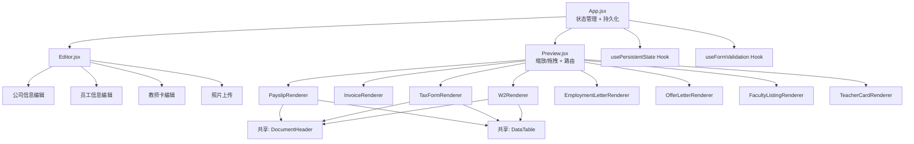

# 设计文档：Payslip Generator 全面优化

## 概述

本设计文档描述 Payslip Generator 项目的全面优化方案。核心策略是：将 1018 行的 Preview.jsx 拆分为独立文档渲染组件，统一货币格式，完善教师卡编辑功能，添加数据持久化和表单验证，改进导出机制，并提升无障碍性。所有改动基于现有 React + Vite 技术栈，不引入新的 UI 框架或状态管理库。

## 架构

### 当前架构问题

```
App.jsx (状态管理)
├── Editor.jsx (编辑面板)
└── Preview.jsx (1018行，7个内联渲染函数)
    ├── renderPayslip()      ~200行
    ├── renderInvoice()      ~100行
    ├── renderTaxForm()      ~60行
    ├── renderW2()           ~60行
    ├── renderEmploymentLetter() ~60行
    ├── renderOfferLetter()  ~80行
    ├── renderFacultyListing() ~150行
    └── renderTeacherCard()  ~300行
```

### 目标架构



## 组件与接口

### 1. 文档渲染组件拆分

每个文档渲染组件从 Preview.jsx 中提取为独立文件，放置在 `src/components/renderers/` 目录下。

#### 目录结构

```
src/components/
├── Preview.jsx              # 精简为路由 + 缩放/拖拽逻辑
├── Editor.jsx               # 增加教师卡编辑区域
├── PhotoUploader.jsx         # 照片上传组件
├── DynamicTable.jsx          # 现有
├── InputGroup.jsx            # 现有（增加验证支持）
├── renderers/
│   ├── PayslipRenderer.jsx
│   ├── InvoiceRenderer.jsx
│   ├── TaxFormRenderer.jsx
│   ├── W2Renderer.jsx
│   ├── EmploymentLetterRenderer.jsx
│   ├── OfferLetterRenderer.jsx
│   ├── FacultyListingRenderer.jsx
│   ├── TeacherCardRenderer.jsx
│   └── shared/
│       ├── DocumentHeader.jsx
│       ├── DataTable.jsx
│       └── InfoRow.jsx
```

#### 渲染组件 Props 接口

```jsx
// All renderers receive a common props shape
interface RendererProps {
  state: AppState;           // Complete application state
  companyLogo?: string;      // Base64 logo image
  photoBase64?: string;      // Base64 photo (for faculty/teacher card)
  mode?: 'employee' | 'contractor'; // Only for PayslipRenderer
  cardStyle?: 'original' | 'modern' | 'simple'; // Only for TeacherCardRenderer
}
```

#### 精简后的 Preview.jsx

```jsx
const Preview = ({ state, docType, mode, companyLogo, cardStyle, photoBase64 }) => {
  const [zoomLevel, setZoomLevel] = useState(70);
  // ... drag state ...

  const rendererMap = {
    payslip: mode === 'contractor' 
      ? <InvoiceRenderer state={state} companyLogo={companyLogo} />
      : <PayslipRenderer state={state} companyLogo={companyLogo} />,
    tax: <TaxFormRenderer state={state} companyLogo={companyLogo} />,
    w2: <W2Renderer state={state} companyLogo={companyLogo} />,
    employment: <EmploymentLetterRenderer state={state} companyLogo={companyLogo} />,
    offer: <OfferLetterRenderer state={state} companyLogo={companyLogo} />,
    faculty: <FacultyListingRenderer state={state} companyLogo={companyLogo} photoBase64={photoBase64} />,
    teacherCard: <TeacherCardRenderer state={state} cardStyle={cardStyle} photoBase64={photoBase64} />,
  };

  return (
    <div className="preview-panel" ...>
      <div className="zoom-controls">...</div>
      <div className="payslip-container" style={{ transform: ... }}>
        {rendererMap[docType]}
      </div>
    </div>
  );
};
```

### 2. 共享子组件

#### DocumentHeader

```jsx
// Renders company header with optional logo
const DocumentHeader = ({ company, companyLogo, title, subtitle, centered = true }) => (
  <header className={centered ? "payslip-header-centered" : ""}>
    {companyLogo && }
    {title && <h1>{title}</h1>}
    {subtitle && <h2 className="company-name">{subtitle}</h2>}
    <div className="company-address">{company.address}</div>
  </header>
);
```

#### DataTable

```jsx
// Renders a data table with configurable columns
const DataTable = ({ title, columns, rows, showFooter = false, footerRow }) => (
  <div className="table-section">
    {title && <h3 className="section-title">{title}</h3>}
    <table className="payslip-table-modern">
      <thead>
        <tr>{columns.map(col => <th key={col.key} className={col.align === 'right' ? 'col-right' : ''}>{col.label}</th>)}</tr>
      </thead>
      <tbody>
        {rows.map((row, i) => (
          <tr key={i}>{columns.map(col => <td key={col.key} className={col.align === 'right' ? 'col-right' : ''}>{row[col.key]}</td>)}</tr>
        ))}
      </tbody>
      {showFooter && footerRow && <tfoot><tr>{columns.map(col => <td key={col.key} className={col.align === 'right' ? 'col-right' : ''}>{footerRow[col.key]}</td>)}</tr></tfoot>}
    </table>
  </div>
);
```

#### InfoRow

```jsx
// Renders a label-value pair
const InfoRow = ({ label, value }) => (
  <div className="info-row">
    <span className="label">{label}</span>
    <span className="value">{value}</span>
  </div>
);
```

### 3. 统一货币格式化

修改 `src/utils/calculations.js` 中的 `formatCurrency`：

```javascript
export const formatCurrency = (amount) => {
  const numericAmount = Number(amount);
  if (isNaN(numericAmount)) {
    return new Intl.NumberFormat('en-US', { style: 'currency', currency: 'USD' }).format(0);
  }
  return new Intl.NumberFormat('en-US', { style: 'currency', currency: 'USD' }).format(numericAmount);
};
```

同时移除 Preview.jsx 中所有直接使用 `toLocaleString('en-US', ...)` 和 `$` 前缀的硬编码格式化，统一调用 `formatCurrency`。

### 4. 教师卡编辑器

在 Editor.jsx 中新增教师卡专属编辑区域，当 `docType === 'teacherCard'` 时显示。

需要在 `initialState.js` 中扩展状态：

```javascript
teacherCard: {
  universityId: null,        // Selected university index or null for auto
  department: '',            // Selected department
  emergencyPhone: '',        // Emergency contact phone
  officeRoom: '',            // Office room number
  yearsOfService: '',        // Years of service
  validUntil: '',            // Card expiry date (YYYY-MM-DD)
}
```

Editor 中的教师卡编辑区域需要：
- 大学选择下拉框（从 `universities.js` 的 UNIVERSITIES 数组加载选项）
- 部门选择下拉框（根据选中大学动态加载 `university.departments`）
- 紧急联系电话输入框
- 办公室号码输入框
- 服务年限数字输入框
- 有效期日期输入框

### 5. 照片上传组件

```jsx
const PhotoUploader = ({ photoBase64, onPhotoChange, onFetchRandom }) => {
  const fileInputRef = useRef(null);

  const handleFileSelect = (e) => {
    const file = e.target.files[0];
    if (!file) return;
    if (!file.type.startsWith('image/')) return;
    
    const img = new Image();
    const reader = new FileReader();
    reader.onload = (event) => {
      img.onload = () => {
        if (img.width > 4096 || img.height > 4096) {
          alert('Image dimensions must not exceed 4096x4096 pixels.');
          return;
        }
        onPhotoChange(event.target.result);
      };
      img.src = event.target.result;
    };
    reader.readAsDataURL(file);
  };

  return (
    <div className="photo-uploader">
      {photoBase64 ? (
        
      ) : (
        <div className="photo-placeholder">No Photo</div>
      )}
      <input type="file" accept="image/jpeg,image/png" ref={fileInputRef} onChange={handleFileSelect} style={{ display: 'none' }} />
      <button onClick={() => fileInputRef.current?.click()} aria-label="Upload photo from local file">
        📤 Upload Photo
      </button>
      <button onClick={onFetchRandom} aria-label="Fetch random photo">
        🎲 Random Photo
      </button>
    </div>
  );
};
```

### 6. 状态持久化 Hook

```javascript
// src/hooks/usePersistentState.js
const STORAGE_KEY = 'payslip-generator-state';
const DEBOUNCE_MS = 500;

function usePersistentState(initialState) {
  const [state, setState] = useState(() => {
    try {
      const saved = localStorage.getItem(STORAGE_KEY);
      if (saved) {
        return JSON.parse(saved);
      }
    } catch (e) {
      localStorage.removeItem(STORAGE_KEY);
    }
    return initialState;
  });

  useEffect(() => {
    const timer = setTimeout(() => {
      try {
        localStorage.setItem(STORAGE_KEY, JSON.stringify(state));
      } catch (e) {
        console.error('Failed to save state:', e);
      }
    }, DEBOUNCE_MS);
    return () => clearTimeout(timer);
  }, [state]);

  const resetState = () => {
    localStorage.removeItem(STORAGE_KEY);
    setState(initialState);
  };

  return [state, setState, resetState];
}
```

### 7. 表单验证

在 InputGroup 组件中增加验证支持：

```jsx
const InputGroup = ({ label, value, onChange, type = "text", required = false, validate }) => {
  const id = useId();
  const [error, setError] = useState('');

  const handleChange = (e) => {
    let newValue = e.target.value;
    if (type === 'number') {
      if (newValue === '' || newValue === '-') {
        onChange(newValue);
        setError('');
        return;
      }
      const num = Number(newValue);
      if (isNaN(num)) return; // Block non-numeric input
      onChange(num);
      if (num < 0) setError('Value is negative');
      else setError('');
      return;
    }
    onChange(newValue);
    if (required && !newValue.trim()) setError('This field is required');
    else setError('');
  };

  return (
    <div className="input-group">
      <label htmlFor={id}>{label}</label>
      <input
        id={id}
        type={type}
        value={value}
        onChange={handleChange}
        className={error ? 'input-error' : ''}
        aria-invalid={!!error}
        aria-describedby={error ? `${id}-error` : undefined}
      />
      {error && <span id={`${id}-error`} className="error-text" role="alert">{error}</span>}
    </div>
  );
};
```

### 8. 导出功能改进

改进 `exportToZip` 函数：

```javascript
export async function exportToZip(state, setDocType, onProgress) {
  const allDocTypes = ['payslip', 'tax', 'w2', 'employment', 'offer', 'faculty'];
  const originalDocType = /* capture current docType before starting */;
  const failedDocs = [];

  for (let i = 0; i < allDocTypes.length; i++) {
    const docType = allDocTypes[i];
    onProgress?.({ current: i + 1, total: allDocTypes.length, docType });
    
    setDocType(docType);
    
    // Wait for React render cycle using requestAnimationFrame + microtask
    await new Promise(resolve => {
      requestAnimationFrame(() => {
        requestAnimationFrame(() => resolve());
      });
    });

    try {
      const element = document.querySelector('.payslip-container');
      if (!element) { failedDocs.push(docType); continue; }
      const canvas = await html2canvas(element, { ... });
      zip.file(filename, base64Data, { base64: true });
    } catch (e) {
      failedDocs.push(docType);
    }
  }

  // Restore original doc type
  setDocType(originalDocType);
  
  if (failedDocs.length > 0) {
    alert(`Export completed. Failed documents: ${failedDocs.join(', ')}`);
  }
}
```

### 9. 无障碍改进

- InputGroup: 使用 `useId()` 生成唯一 ID，`<label htmlFor={id}>` 关联 `<input id={id}>`
- 缩放按钮: 添加 `aria-label="Zoom in"` 和 `aria-label="Zoom out"`
- 导航按钮: 当前选中的文档类型按钮添加 `aria-current="page"`
- 删除按钮: 添加 `aria-label="Remove item"`
- 添加按钮: 添加 `aria-label="Add new item"`

## 数据模型

### 扩展后的应用状态

```javascript
// initialState.js - 新增字段
{
  // ... existing fields ...
  teacherCard: {
    universityId: null,       // number | null - index in UNIVERSITIES array
    department: '',           // string - department name
    emergencyPhone: '',       // string - emergency contact phone
    officeRoom: '',           // string - office room number
    yearsOfService: '',       // string | number - years of service
    validUntil: '',           // string - YYYY-MM-DD expiry date
  }
}
```

### localStorage 数据格式

```javascript
// Key: 'payslip-generator-state'
// Value: JSON.stringify(appState)
// Note: Date fields stored as ISO strings, restored as-is (already strings in state)
```


## 正确性属性

*正确性属性是系统在所有有效执行中都应保持为真的特征或行为——本质上是关于系统应该做什么的形式化陈述。属性是人类可读规范与机器可验证正确性保证之间的桥梁。*

### Property 1: 货币格式一致性

*For any* 数值类型的金额，`formatCurrency` 的输出 SHALL 是以 `$` 开头、包含千位分隔符（逗号）和恰好两位小数的字符串，且符合 `en-US` 区域格式。

**Validates: Requirements 2.1, 2.2**

### Property 2: 非数值货币处理

*For any* 非数值输入（undefined、null、NaN、非数字字符串），`formatCurrency` SHALL 返回 `$0.00`。

**Validates: Requirements 2.3**

### Property 3: 部门列表与大学匹配

*For any* 从 UNIVERSITIES 数组中选择的大学，教师卡编辑器中显示的部门列表 SHALL 仅包含该大学对象的 `departments` 数组中的部门。

**Validates: Requirements 3.3**

### Property 4: 教师卡字段响应性

*For any* 教师卡编辑字段的修改，TeacherCardRenderer 的渲染输出 SHALL 包含修改后的值。

**Validates: Requirements 3.8**

### Property 5: 照片尺寸验证

*For any* 图片尺寸对 (width, height)，当 width ≤ 4096 且 height ≤ 4096 时 Photo_Uploader SHALL 接受该图片，否则 SHALL 拒绝。

**Validates: Requirements 4.5**

### Property 6: 状态序列化往返一致性

*For any* 有效的应用状态对象，`JSON.parse(JSON.stringify(state))` SHALL 产生与原始状态深度相等的对象。

**Validates: Requirements 5.2, 5.6, 5.7**

### Property 7: 数字输入转换

*For any* 合法数字字符串（如 "123"、"45.67"、"-89"），数字类型输入字段的 onChange 处理 SHALL 将其转换为对应的 Number 类型值。

**Validates: Requirements 6.1**

### Property 8: 非数字输入拒绝

*For any* 非数字字符串（如 "abc"、"12.34.56"、"$100"），数字类型输入字段 SHALL 阻止该输入，字段值保持不变。

**Validates: Requirements 6.2**

### Property 9: 负数金额警告

*For any* 负数值输入到金额字段，Form_Validator SHALL 产生警告状态（error 非空）。

**Validates: Requirements 6.3**

### Property 10: 必填字段非空验证

*For any* 纯空白字符串（空字符串或仅包含空格/制表符），当输入到标记为 required 的字段时，Form_Validator SHALL 产生验证错误状态。

**Validates: Requirements 6.4, 6.5**

### Property 11: 导出部分失败时的容错性

*For any* 文档类型子集导出失败的情况，Export_Manager SHALL 仍然成功导出其余文档，且 ZIP 文件中包含所有成功导出的文档。

**Validates: Requirements 7.4**

### Property 12: 导出后恢复原始文档类型

*For any* 导出前的文档类型选择，导出完成后 SHALL 恢复到该文档类型。

**Validates: Requirements 7.5**

### Property 13: Label-Input 关联

*For any* Editor 中的 `<input>` 元素，SHALL 存在一个 `<label>` 元素其 `htmlFor` 属性值等于该 `<input>` 的 `id` 属性值。

**Validates: Requirements 9.1**

### Property 14: 按钮 aria-label

*For any* Editor 中的操作按钮（添加、删除、上传），SHALL 具有非空的 `aria-label` 属性。

**Validates: Requirements 9.3**

### Property 15: 导航按钮 aria-current

*For any* 当前选中的文档类型，对应的导航按钮 SHALL 具有 `aria-current="page"` 属性，其余导航按钮 SHALL 不具有该属性。

**Validates: Requirements 9.4**

## 错误处理

### 货币格式化错误
- 非数值输入：转换为 0，返回 `$0.00`
- Infinity/-Infinity：由 `Intl.NumberFormat` 处理，输出 `$∞` 或类似表示

### 状态持久化错误
- localStorage 不可用（隐私模式）：静默失败，仅在内存中保持状态
- JSON 解析失败：清除损坏数据，回退到 INITIAL_STATE
- 存储配额超出：捕获 QuotaExceededError，记录警告

### 照片上传错误
- 非图片文件：忽略，不更新状态
- 超大图片（>4096px）：显示提示，不更新状态
- FileReader 失败：捕获错误，保持当前照片不变

### 导出错误
- html2canvas 渲染失败：跳过该文档，记录到失败列表
- ZIP 生成失败：显示错误提示
- 单个文档失败不影响其余文档导出

### 表单验证错误
- 数字字段非数值输入：阻止输入，保持当前值
- 必填字段为空：显示红色边框和错误提示
- 负数金额：显示黄色警告（不阻止输入）

## 测试策略

### 测试框架

- 单元测试和属性测试：Vitest
- 属性测试库：[fast-check](https://github.com/dubzzz/fast-check)（JavaScript/TypeScript 最成熟的属性测试库）
- 组件测试：@testing-library/react（已有依赖）
- 每个属性测试最少运行 100 次迭代

### 双重测试方法

#### 单元测试（具体示例和边界情况）

- `formatCurrency` 的具体值测试：`formatCurrency(1234.5)` → `"$1,234.50"`
- 状态持久化的 localStorage mock 测试
- 各文档渲染组件的快照/渲染测试
- 教师卡编辑器的交互测试
- 导出功能的 mock 测试
- App.test.jsx 中过时断言的修复

#### 属性测试（通用属性验证）

每个属性测试必须以注释标注对应的设计属性：

```javascript
// Feature: payslip-generator-overhaul, Property 1: Currency format consistency
test.prop('formatCurrency produces valid USD format for all numbers', [fc.double()], (amount) => {
  const result = formatCurrency(amount);
  expect(result).toMatch(/^\$[\d,]+\.\d{2}$/); // or handle special cases
});
```

- Property 1: 货币格式一致性 → `fc.double()` 生成随机数值
- Property 2: 非数值货币处理 → `fc.oneof(fc.string(), fc.constant(null), fc.constant(undefined))` 生成非数值
- Property 6: 状态序列化往返 → 自定义 Arbitrary 生成有效状态对象
- Property 7: 数字输入转换 → `fc.double()` 转字符串后验证
- Property 8: 非数字输入拒绝 → `fc.string().filter(s => isNaN(Number(s)))` 生成非数字字符串
- Property 10: 必填字段非空验证 → `fc.stringOf(fc.constantFrom(' ', '\t', '\n'))` 生成空白字符串

### 测试文件组织

```
src/
├── utils/
│   ├── calculations.test.js      # 更新：增加 formatCurrency 属性测试
│   └── persistence.test.js       # 新增：状态持久化测试
├── components/
│   ├── renderers/
│   │   └── __tests__/
│   │       └── renderers.test.jsx  # 各渲染组件基本渲染测试
│   └── __tests__/
│       ├── InputGroup.test.jsx     # 表单验证属性测试
│       └── PhotoUploader.test.jsx  # 照片上传测试
└── App.test.jsx                    # 修复并更新
```
